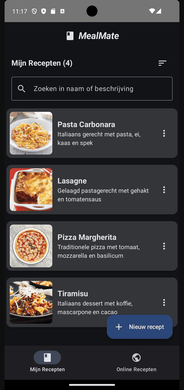

# RecipeBook (Android / Jetpack Compose)

**Rol:** Solo | **Jaar:** 2025

Jetpack Compose showcase app die TheMealDB-recepten combineert met een lichte eigen receptenbeheerder.

## Tech stack
- Kotlin
- Jetpack Compose + Material 3
- AndroidX Navigation Compose
- Retrofit & Gson voor TheMealDB
- Coil voor afbeeldingen
- Kotlin Coroutines Flow voor state management

## Highlights
- Online recepten zoeken, filteren en random ophalen via TheMealDB API.
- Schermflow online lijst -> detail -> lokale collectie, volledig in Compose.
- Eigen recepten aanmaken, bewerken en verwijderen in een in-memory repository met live updates.
- Afbeeldingencache en foutafhandeling voor netwerk en invoer.

## Demo

## Snel starten
1. Android Studio Iguana (of nieuwer) met Android SDK 35.
2. Repo clonen of openen in Android Studio.
3. Gradle sync en run op een emulator of fysiek toestel (minSdk 24).

## Structuur
- 'app/ui' bevat de Compose-schermen en theming.
- 'app/viewmodel' regelt UI-state en businesslogica.
- 'app/repository' scheidt online API-calls en lokale opslag.
